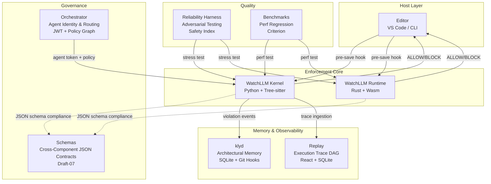
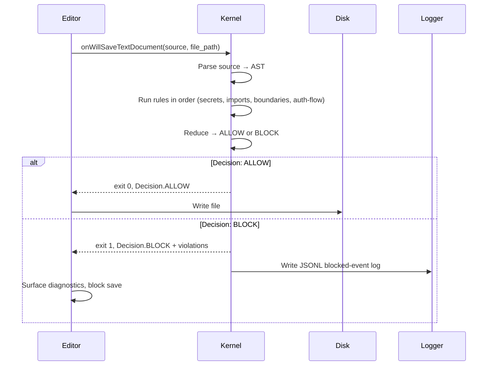
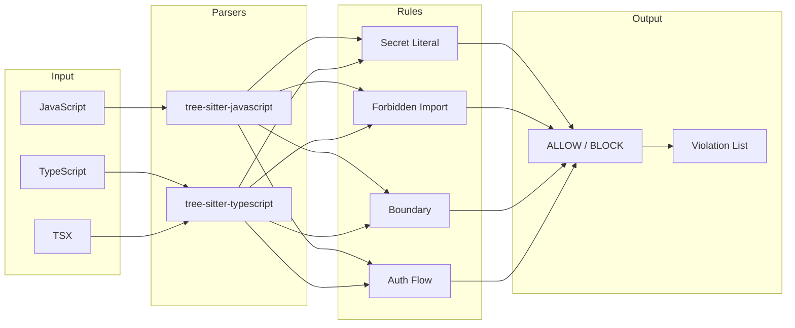

# System Architecture & Boundaries

> Agents are probabilistic. Infrastructure cannot be.

## Architecture Diagram



## System Layers

### 1. Host Layer

The entry point for all enforcement. Two integration paths exist:

- **Editor Integration**: VS Code extension intercepts `onWillSaveTextDocument` and invokes the kernel before allowing disk write.
- **CLI Fallback**: Direct invocation via `watchllm-kernel evaluate` for CI/CD, pre-commit hooks, and manual checks.

### 2. Enforcement Core

The deterministic write-path gate. Two implementations with full parity:

- **Kernel (Python)**: Reference implementation using Tree-sitter for AST parsing. Pure, offline-capable, no network dependency on the critical path.
- **Runtime (Rust + Wasm)**: High-performance port with zero-process-latency embedding. Compiles to WebAssembly for browser/edge use. Maintains exact JSON schema parity with the Python kernel.

### 3. Memory & Observability

Passive telemetry and architectural trace layers that never block the write path:

- **klyd**: Persistent architectural memory engine. Tracks architectural intent via git hooks that parse commits into `NEW`, `REINFORCE`, or `CONTRADICT` SQLite mutations.
- **Replay**: Execution graph observability. Ingests tool-call traces and renders them as interactive DAGs for debugging agent behavior.

### 4. Governance

Agent identity, authorization, and policy distribution:

- **Orchestrator**: Issues agent identity tokens (JWT), routes to appropriate models based on capability requirements, and enforces path-based policy graphs.
- **Schemas**: Canonical JSON Schema (Draft-07) contracts defining every cross-component data structure: violations, decisions, kernel execution results, and events.

### 5. Quality

Continuous validation of enforcement correctness and performance:

- **Reliability Harness**: Adversarial stress-testing framework. Runs prompt injection, kernel enforcement, and tool abuse suites. Computes a quantitative Safety Index.
- **Benchmarks**: Criterion-based performance benchmarks for both Python and Rust runtimes.

## Data Flow: Save Path



## Runtime Boundaries

Each subsystem has explicit knowledge boundaries:

| Subsystem | Knows About | Does NOT Know About |
|-----------|-------------|---------------------|
| **Kernel** | Source text, AST structure, rules, file paths | Editor UI, agent identity, policy graphs |
| **Runtime** | Same as Kernel (Rust port) | Same as Kernel |
| **klyd** | Git diffs, commit messages, SQLite | AST internals, enforcement rules |
| **Replay** | Tool-call traces, DAG structure | Source code content, enforcement decisions |
| **Orchestrator** | Agent tokens, model routing, path policies | Source code, AST, enforcement rules |
| **Schemas** | JSON structure, data contracts | Any implementation detail |
| **Reliability** | Test suites, agent output | Production enforcement paths |
| **VS Code Extension** | Document state, diagnostics, kernel subprocess | Rule internals, AST structure |

## Language Runtime Mapping



## Deployment Topology

```
┌─────────────────────────────────────────────┐
│                 Developer Machine             │
│  ┌─────────┐  ┌──────────┐  ┌────────────┐  │
│  │ VS Code │  │  Kernel  │  │    klyd    │  │
│  │  Ext.   │──│ (Python) │  │ (Git Hooks)│  │
│  └─────────┘  └──────────┘  └────────────┘  │
│                     │                         │
│              ┌──────┴──────┐                  │
│              │   Replay    │                  │
│              │ (localhost) │                  │
│              └─────────────┘                  │
└─────────────────────────────────────────────┘

┌─────────────────────────────────────────────┐
│              CI/CD Pipeline                   │
│  ┌──────────┐  ┌────────────┐               │
│  │  Kernel  │  │ Reliability │               │
│  │   CLI    │  │  Harness    │               │
│  └──────────┘  └────────────┘               │
└─────────────────────────────────────────────┘

┌─────────────────────────────────────────────┐
│           Browser / Edge Runtime              │
│  ┌──────────────────────┐                    │
│  │  Runtime (Wasm)      │                    │
│  │  Zero-process latency│                    │
│  └──────────────────────┘                    │
└─────────────────────────────────────────────┘
```

## Cross-Component Contracts

All components communicate through the schemas defined in `schemas/v1/`:

| Contract | Producer | Consumers |
|----------|----------|-----------|
| `violation.json` | Kernel, Runtime | VS Code, klyd, Replay, Orchestrator |
| `decision.json` | Kernel, Runtime | VS Code, klyd |
| `kernel_execution_result.json` | Runtime (Wasm + CLI) | VS Code, klyd, Replay, Orchestrator |
| `event.json` | (future telemetry) | Replay, Cloud Dashboard |